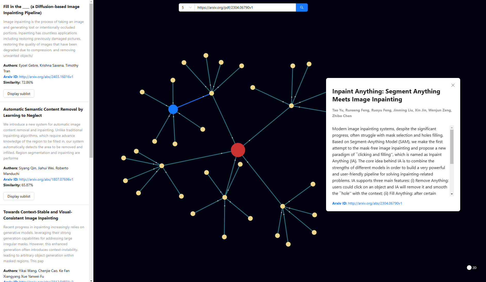

# Article Similarity Graph

The **Article Similarity Graph** is an advanced visualization tool designed to assist users in exploring relationships between articles in a structured and intuitive manner. By analyzing connections between topics, the tool helps uncover insights, patterns, and relationships within large sets of articles.

---

## Key Features

### **Centralized Focus**
- The primary article is prominently displayed at the center of the graph.
- Related articles are positioned around the main article, with proximity indicating the degree of similarity.

### **Interactive Exploration**
- Click on any article node to view detailed metadata and associated information.
- Seamlessly navigate between articles to explore their connections in-depth.

### **Efficient Identification of Related Content**
- Instantly identify the most relevant articles related to your primary topic.
- Save time by focusing on the most pertinent information in a dataset.

### **Flexible and User-Friendly Navigation**
- Switch between detailed views and a high-level overview effortlessly.
- Explore content with intuitive, responsive, and customizable controls.

### **Customization Options**
- Define the number of related articles displayed on the graph.

### **Integration with ArXiv and Scopus**
- Input ArXiv article identifiers (arXiv ID) for seamless integration with the ArXiv database.
- Utilize Scopus article identifiers for cross-referencing and enhanced discovery.
